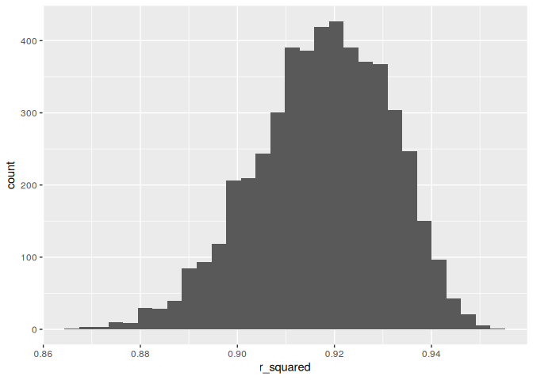
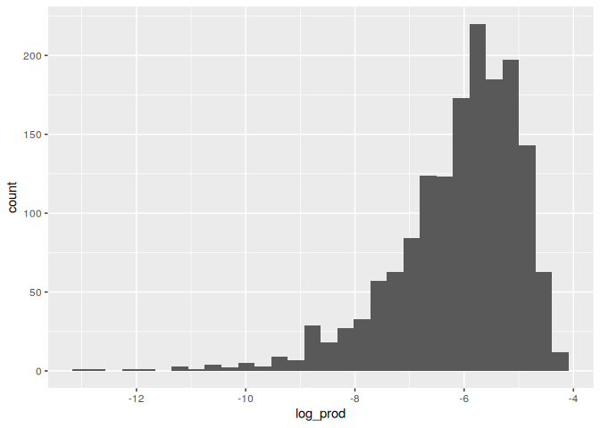

Homework 6
================
Joshua Carpenter
2023-11-28

## Problem 2

``` r
weather_df = 
  rnoaa::meteo_pull_monitors(
    c("USW00094728"),
    var = c("PRCP", "TMIN", "TMAX"), 
    date_min = "2022-01-01",
    date_max = "2022-12-31") |>
  mutate(
    name = recode(id, USW00094728 = "CentralPark_NY"),
    tmin = tmin / 10,
    tmax = tmax / 10) |>
  select(name, id, everything())
```

    ## using cached file: /home/joshua/.cache/R/rnoaa/noaa_ghcnd/USW00094728.dly

    ## date created (size, mb): 2023-11-28 10:32:53.576627 (8.544)

    ## file min/max dates: 1869-01-01 / 2023-11-30

``` r
weather_boot_df <- weather_df %>%
  modelr::bootstrap(n = 5000) %>%
  mutate(models = map(strap, \(df) lm(tmax ~ tmin + prcp, data = df)),
         r_squared = map(models, \(model) summary(model)$r.squared) %>% unlist(),
         coeffs = map(models, coefficients)) %>%
  unnest_wider(coeffs) %>%
  mutate(log_prod = log(ifelse(tmin * prcp > 0, tmin * prcp, NA))) %>%
  select(.id, r_squared, log_prod)

ggplot(data = weather_boot_df, mapping = aes(x = r_squared)) +
  geom_histogram()
```

    ## `stat_bin()` using `bins = 30`. Pick better value with `binwidth`.

<!-- -->

``` r
ggplot(data = weather_boot_df, mapping = aes(x = log_prod)) +
  geom_histogram(na.rm = TRUE)
```

    ## `stat_bin()` using `bins = 30`. Pick better value with `binwidth`.

<!-- -->
